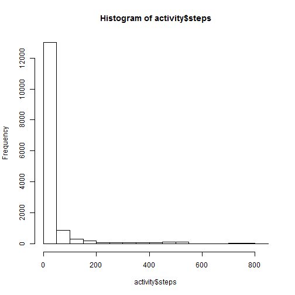
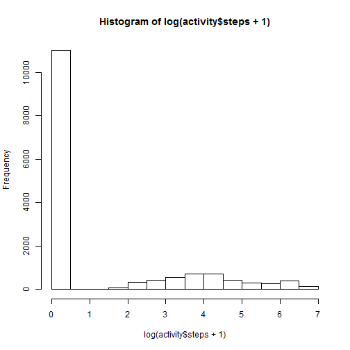
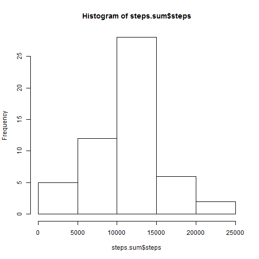
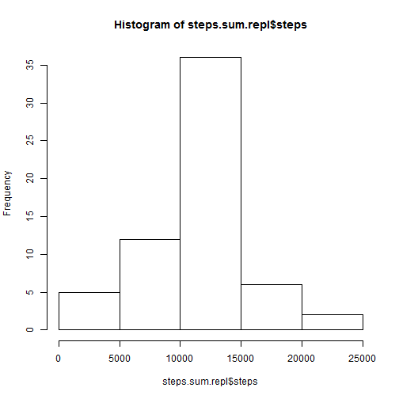
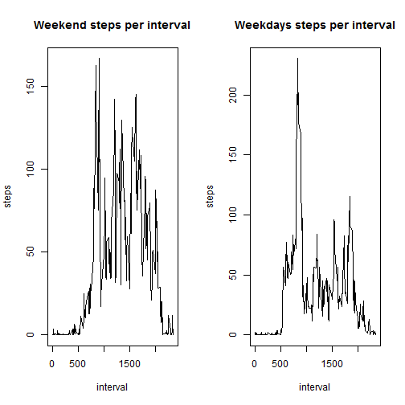

#Assignment 1

##Processing the data

Set the working directory and read the data using the read.csv function


```r
setwd("C:\\Users\\r01mhm13\\Documents\\PhD\\Courses\\Reproducible_research")
activity<-read.csv("activity.csv")
str(activity)
```

```
## 'data.frame':	17568 obs. of  3 variables:
##  $ steps   : int  NA NA NA NA NA NA NA NA NA NA ...
##  $ date    : Factor w/ 61 levels "2012-10-01","2012-10-02",..: 1 1 1 1 1 1 1 1 1 1 ...
##  $ interval: int  0 5 10 15 20 25 30 35 40 45 ...
```

A histogram of the "steps" variable shows that the data is skewed.


```r
hist(activity$steps)
```

 

Transforming the data by adding one (to take zeros into account) and taking the log does improve the distribution.However, there are still numerous zero values.


```r
hist(log(activity$steps+1))
```

 

##What is mean total number of steps taken per day?

The total number of steps taken per day is calculated using the aggregate function


```r
steps.sum<-aggregate(steps~date, data=activity,FUN=sum,na.rm=T)
str(steps.sum)
```

```
## 'data.frame':	53 obs. of  2 variables:
##  $ date : Factor w/ 61 levels "2012-10-01","2012-10-02",..: 2 3 4 5 6 7 9 10 11 12 ...
##  $ steps: int  126 11352 12116 13294 15420 11015 12811 9900 10304 17382 ...
```

A histogram is generated for the sum of the steps taken each day


```r
hist(steps.sum$steps)
```

 

The mean and median values for the number of steps taken on each date is calculated using the aggregate function again.


```r
steps.mean<-aggregate(steps~date, data=activity,FUN=mean,na.rm=T)
str(steps.mean)
```

```
## 'data.frame':	53 obs. of  2 variables:
##  $ date : Factor w/ 61 levels "2012-10-01","2012-10-02",..: 2 3 4 5 6 7 9 10 11 12 ...
##  $ steps: num  0.438 39.417 42.069 46.16 53.542 ...
```

```r
steps.median<-aggregate(steps~date, data=activity,FUN=median,na.rm=T)
str(steps.median)
```

```
## 'data.frame':	53 obs. of  2 variables:
##  $ date : Factor w/ 61 levels "2012-10-01","2012-10-02",..: 2 3 4 5 6 7 9 10 11 12 ...
##  $ steps: num  0 0 0 0 0 0 0 0 0 0 ...
```

##What is the average daily activity pattern?

A time series plot of the average number of steps taken for each interval across all the days is generated using base plot.To generate the plot the mean has to be calculated across the intervals using the aggregate function.


```r
interval.mean<-aggregate(steps~interval, data=activity,FUN=mean,na.rm=T)
plot(interval.mean,type="l")
```

 

To find the interval with the highest average number of steps the max function is used on the the interval.mean data frame and the index is used to extract the appropriate interval.


```r
interval.mean$interval[which(interval.mean$steps==max(interval.mean$steps))]
```

```
## [1] 835
```


##Missing values 

Calculating the number of missing values using is.na and sum functions


```r
sum(is.na(activity$steps))
```

```
## [1] 2304
```

The missing values are replaced by the mean for each time interval. This approach seems more appropriate given that it appears that there is less varaibility across the same time interval than there is across the same day.The data frame with replaced value is renamed activity.repl.


```r
activity.repl<-activity
str(activity.repl)
```

```
## 'data.frame':	17568 obs. of  3 variables:
##  $ steps   : int  NA NA NA NA NA NA NA NA NA NA ...
##  $ date    : Factor w/ 61 levels "2012-10-01","2012-10-02",..: 1 1 1 1 1 1 1 1 1 1 ...
##  $ interval: int  0 5 10 15 20 25 30 35 40 45 ...
```

```r
NAs<-which(is.na(activity$steps))

for (i in NAs){
  int<-activity.repl$interval[i]
  activity.repl$steps[i]<-interval.mean$steps[which(interval.mean$interval==int)]
}
str(activity.repl)
```

```
## 'data.frame':	17568 obs. of  3 variables:
##  $ steps   : num  1.717 0.3396 0.1321 0.1509 0.0755 ...
##  $ date    : Factor w/ 61 levels "2012-10-01","2012-10-02",..: 1 1 1 1 1 1 1 1 1 1 ...
##  $ interval: int  0 5 10 15 20 25 30 35 40 45 ...
```


Generate a histogram for the total number of steps taken each day from the activity.repl data frame.


```r
steps.sum.repl<-aggregate(steps~date, data=activity.repl,FUN=sum,na.rm=T)
hist(steps.sum.repl$steps)
```

 

Recalculating the mean and median for each date does not seem to change the estimates generated in the first part of the assignment. The 


```r
steps.mean.repl<-aggregate(steps~date, data=activity.repl,FUN=mean,na.rm=T)
str(steps.mean)
```

```
## 'data.frame':	53 obs. of  2 variables:
##  $ date : Factor w/ 61 levels "2012-10-01","2012-10-02",..: 2 3 4 5 6 7 9 10 11 12 ...
##  $ steps: num  0.438 39.417 42.069 46.16 53.542 ...
```

```r
steps.median.repl<-aggregate(steps~date, data=activity.repl,FUN=median,na.rm=T)
str(steps.median)
```

```
## 'data.frame':	53 obs. of  2 variables:
##  $ date : Factor w/ 61 levels "2012-10-01","2012-10-02",..: 2 3 4 5 6 7 9 10 11 12 ...
##  $ steps: num  0 0 0 0 0 0 0 0 0 0 ...
```

##Are there differences in activity patterns between weekdays and weekends?

Use the weekdays function to assign a day to each date. The use the %in% operator to assign each day as weekend or weekday before coercing to a factor variable.


```r
activity.repl$day<-weekdays(as.Date(activity.repl$date))

weekend<-which(activity.repl$day %in% c("Sunday","Saturday"))

activity.repl$weekday<-rep(NA,length(activity.repl$day))
activity.repl$weekday[-weekend]<-"Weekday"
activity.repl$weekday[weekend]<-"Weekend"
activity.repl$weekday<-as.factor(activity.repl$weekday)
str(activity.repl)
```

```
## 'data.frame':	17568 obs. of  5 variables:
##  $ steps   : num  1.717 0.3396 0.1321 0.1509 0.0755 ...
##  $ date    : Factor w/ 61 levels "2012-10-01","2012-10-02",..: 1 1 1 1 1 1 1 1 1 1 ...
##  $ interval: int  0 5 10 15 20 25 30 35 40 45 ...
##  $ day     : chr  "Monday" "Monday" "Monday" "Monday" ...
##  $ weekday : Factor w/ 2 levels "Weekday","Weekend": 1 1 1 1 1 1 1 1 1 1 ...
```

Generate time series plots for the weekdays and weekends.


```r
par(mfrow=c(1,2))
weekend.df<-activity.repl[weekend,]
interval.mean.weekend<-aggregate(steps~interval, data=weekend.df,FUN=mean,na.rm=T)
plot(interval.mean.weekend,type="l",main="Weekend steps per interval")

weekday.df<-activity.repl[-weekend,]
interval.mean.weekday<-aggregate(steps~interval, data=weekday.df,FUN=mean,na.rm=T)
plot(interval.mean.weekday,type="l",main="Weekdays steps per interval")
```

 
